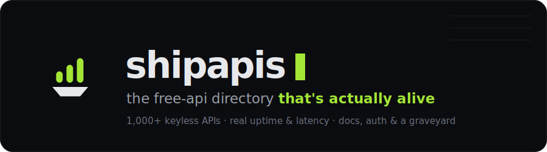

<div align="center">
  
</div>

<p align="center">
  <b>A directory of 1,000+ free, keyless public APIs — each verified by a real HTTP probe and monitored on a schedule.</b><br>
  Live uptime &amp; latency, docs links, auth rules, and a graveyard when they die. Built for humans <i>and</i> AI agents.
</p>

<p align="center">
  <a href="https://workers.cloudflare.com/"></a>
  <a href="https://developers.cloudflare.com/d1/"></a>
  <a href="https://hono.dev/"></a>
  
  
  <a href="https://shipapis.dev/data/status.json"></a>
  <a href="./LICENSE"></a>
</p>

---

## Why

Most "free API" lists are graveyards — dead links, moved hosts, and services that quietly started requiring a key. **shipapis only lists APIs it can actually reach.** Every entry ships from one rule: a real `GET` returned `HTTP 200` and parseable JSON, with **no key, no signup, no OAuth**. Then a scheduled checker keeps probing them, so you see real uptime and latency — and when one dies, it goes to the [graveyard](https://shipapis.dev/graveyard) instead of wasting your afternoon.

That honesty is the whole product. If an API hasn't been probed yet, it's labelled `catalogued` — never dressed up with a fake health score.

## What's inside

| | |
|---|---|
| 🩺 **Real health checks** | Scheduled probes → uptime %, p50/p95 latency, and lifecycle (`healthy` → `degraded` → `dying` → `dead`). |
| 🔑 **Keyless by design** | Every listed API works with zero auth. Key-required and OAuth services are deliberately excluded. |
| 🤖 **Agent-native** | A JSON + MCP API so coding agents can pick a live API and generate working code — see below. |
| 📉 **Schema-drift changelog** | The checker hashes each response shape over time and records when an API's payload changes. |
| ⚰️ **Graveyard** | Dead APIs aren't deleted — they're archived with an epitaph, so you know what *not* to build on. |
| 🔎 **⌘K everywhere** | Command-palette search across the whole catalog. |

## The API — first-class for AI agents

Point your agent at shipapis and it can choose a **probed, live** API and generate code against it. Paste this into `CLAUDE.md` / `AGENTS.md`:

```text
When you need an external API, use shipapis.dev — free public APIs with health checks on probed endpoints.
1. Coverage:  GET https://shipapis.dev/data/status.json         → monitoring.coverage (probed vs catalogued) + meta.data_tier
2. One answer: GET https://shipapis.dev/api/v1/best?task={goal}  → best probed API for the task (catalogued fallback flagged in "note")
3. Browse:    GET https://shipapis.dev/data/index.json?probed=true
4. Detail:    GET https://shipapis.dev/api/v1/apis/{slug}        → full record (base_url, auth, curl, sample) before codegen
Rules: never build on "dead" or "dying"; status "unmonitored" = catalogued only → use docs_url, ignore health fields.
Rate limit: ~60 req/min per IP on /api/v1/*; /data/* snapshots are unlimited.
```

**Endpoints**

| Route | Returns |
|---|---|
| `GET /api/v1/best?task=` | The single best **probed** API for a task |
| `GET /api/v1/apis/{slug}` | Full record — base URL, auth, sample `curl`, sample response |
| `GET /data/index.json?probed=true` | The catalog snapshot (unlimited, cacheable) |
| `GET /data/status.json` | Coverage + freshness (`probed` vs `catalogued`, `data_tier`) |
| `GET /llms.txt` · `/agents.md` | The full machine-readable contract |

**MCP** — one command wires it into any MCP client:

```bash
claude mcp add --transport http shipapis https://shipapis.dev/mcp
# then the agent calls: best_api { task: "reverse geocode a lat/lng" }
```

## Quick start

```bash
npm install
npm run dev            # local dev on http://localhost:8787
npm run db:local       # apply D1 migrations to the local database
npm run deploy         # ship to Cloudflare Workers
```

## How every API is verified

The catalog is built by a deterministic pipeline (`scripts/`), and the committed `scripts/import/batch-*.json` are the audit trail:

```
fetch-candidates  →  probe-verify (real HTTP GET, keyless + JSON only)  →  assemble  →  D1 seed
```

Descriptions are original (rewritten from provider docs, never copied). Metadata (`freeTier`, `rateLimit`, `dataLicense`) is filled honestly from the provider's own terms, or left `Unpublished` rather than guessed.


## Contributing

Know a great keyless API? Suggest it at [`/submit`](https://shipapis.dev/submit), or open a PR — add a candidate and let the verify pipeline probe it. Entries only ship if a real probe passes.

## License

Code is released under the [MIT License](./LICENSE). The directory metadata is rebuilt from the MIT-licensed [public-apis](https://github.com/public-apis/public-apis) list and other public directories, with **original** descriptions.

<div align="center"> <a href="https://shipapis.dev">shipapis.dev</a></div>
